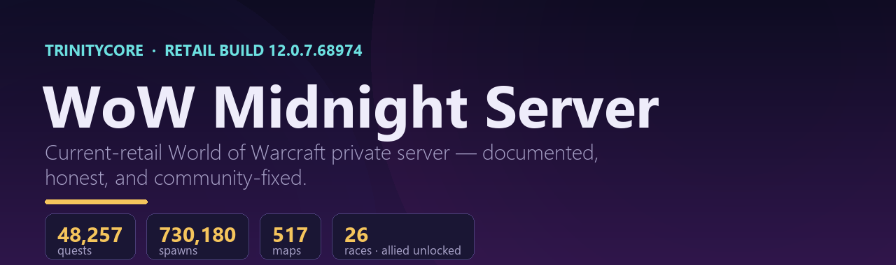
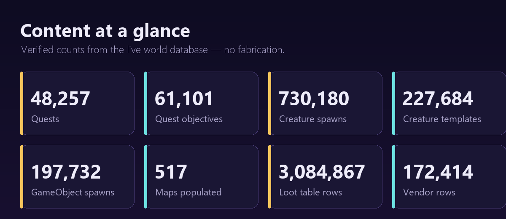
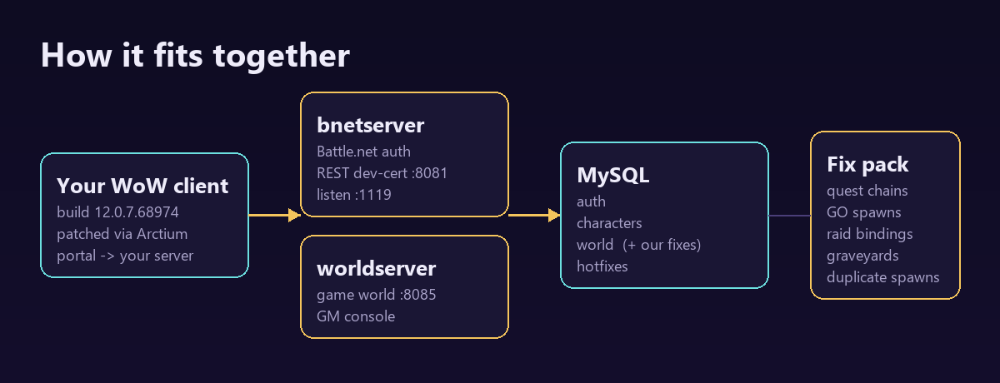

<!-- Language: **English** · [Русский](README.ru.md) -->



# WoW Midnight Server — TrinityCore 12.0.7 (build 68275)

> A documented, community-maintained **World of Warcraft: Midnight** private
> server built on **TrinityCore master**, at the current retail build
> **12.0.7.68275** — plus a set of original server-side fixes that make the
> newest content actually playable.

**🌐 Language:** **English** · [Русский](README.ru.md)

> ⚠️ **Read first:** this repo contains **documentation + our original fixes only**.
> It does **not** include the game client, game data, or a world database —
> those are Blizzard's property and cannot be redistributed. You build those
> yourself from your own retail client. See **[DISCLAIMER.md](DISCLAIMER.md)**.

---

## What makes this project different

Most public WoW private servers run **old expansions** (Wrath 3.3.5a, Cata,
MoP…). This one targets **current retail — patch 12.0.7 "Midnight"** and is
kept honest and playable:

| | This project | Typical private server |
|---|---|---|
| **Client build** | **12.0.7.68275 (Midnight, current retail)** | 3.3.5a / 4.3.4 / 5.4.8 |
| **Races** | All 26 incl. **allied races unlocked**, Dracthyr **Evoker intro** working | Classic races only |
| **Content span** | Vanilla → Midnight in one DB, **517 maps** populated | Single-expansion |
| **A world that lives** | **60 autonomous bots** that fight, gather, smelt, craft, trade, quest and talk — with no player logged in | Usually none / 3rd-party only |
| **Data policy** | Maximized to the **public-data ceiling**, gaps documented honestly | Often silently broken |
| **Fixes** | Curated, reversible, ID-band-safe **community fixes** (this repo) | Ad-hoc |

### Highlights
- **A populated world without players** — see [`bots/`](bots/README.md).
  Socket-less fake players with their own decision loop: they hunt, mine and pick
  herbs, smelt ore and craft with it, sell junk and repair per slot, list goods at
  the auction house and wear what they buy, take quests and walk to where the
  objectives are, group up, chat, mount for long journeys, move zone when they
  outgrow one, and survive server restarts with their progress intact.
  Every claim in that README is a measurement, including the ones that are still
  bad.
- **Newest content, actually reachable** — allied-race and class intros, modern
  zones (Khaz Algar, Isle of Dorn, Harandar) resurrect-able and quest-able.
- **Curated fix pack** — quest-chain repairs, quest-blocking GameObject spawns,
  legacy-raid lockout/journal bindings, newest-zone graveyards. All additive,
  all reversible, all on empty ID bands so they won't clash with a stock install.
- **Honest engineering** — where the engine hits a true ceiling (boss combat AI,
  brand-new phased-scene scripting), it's documented, not faked.

---

## Content at a glance (verified DB counts)

| Metric | Count |
|---|---:|
| Quests | **48,257** |
| Quest objectives | 61,101 |
| Quest starters / enders (NPC) | 27,694 / 34,524 |
| Creature templates / spawns | 227,684 / **733,485** |
| GameObject templates / spawns | 89,967 / 197,724 |
| Maps with spawns | **517** |
| Loot table rows | 3,084,867 |
| Vendor rows | 172,414 |
| Retail build | **12.0.7.68275** |

---



## Gallery

### Architecture



### In-game screenshots

> These are placeholders — drop your own real gameplay screenshots into
> `assets/screenshots/` and they'll show up here. (We ship **no** Blizzard game
> imagery; see [DISCLAIMER](DISCLAIMER.md).)

<!--


-->

_No screenshots yet — contributions welcome._

## Quick start

0. **Get the client** — you download it from Blizzard yourself; it's a free
   download and the guide pins the exact build so it can't drift out of sync
   with your database. → **[docs/en/CLIENT.md](docs/en/CLIENT.md)**
1. **Build the core** — TrinityCore master. → [docs/en/SETUP.md](docs/en/SETUP.md)
2. **Extract game data** from your own retail client (maps/vmaps/mmaps/dbc).
3. **Import the world DB** and run `worldserver` + `bnetserver`.
4. **Apply the community fixes** in [`sql/`](sql/). → [sql/README.md](sql/README.md)
5. **Connect** your client. → [docs/en/CONNECT.md](docs/en/CONNECT.md)

> **Where do I get the client?** From Blizzard, free, yourself — see
> [CLIENT.md](docs/en/CLIENT.md). Please don't ask for or share a client
> download; it's copyright infringement, third-party builds are unverifiable
> binaries, and the official download takes one command.

Full walkthrough: **[docs/en/SETUP.md](docs/en/SETUP.md)** ·
Features & content: **[docs/en/FEATURES.md](docs/en/FEATURES.md)** ·
Fix details: **[docs/en/FIXES.md](docs/en/FIXES.md)**

---

## Repository layout

```
.
├── README.md / README.ru.md      Project overview (EN / RU)
├── CHANGELOG.md                  What's new, measured
├── DISCLAIMER.md                 Legal — what we can and cannot ship
├── LICENSE                       MIT (original materials only)
├── docs/
│   ├── en/  CLIENT · SETUP · CONNECT · FEATURES · FIXES · ANNOUNCEMENT
│   └── ru/  CLIENT · SETUP · CONNECT · FEATURES · FIXES · ANNOUNCEMENT
├── bots/                         Companion bot system (72 scripts + core patch)
│   ├── README.md                 What they do, measured — and what they do badly
│   ├── COMMANDS.md / .ru.md      Every command and config switch, explained
│   ├── src/                      Drop-in for src/server/scripts/Custom/Bots/
│   ├── custom_script_loader.cpp  Replaces TC's empty stub, or nothing registers
│   └── core-patch/               The one nine-line patch the bots need
├── docker/                       Compose deployment (INSTALL.md is the guide)
├── sql/                          Community fix SQL (reversible, ID-band-safe)
└── scripts/                      vmssh.py (env-var creds) · apply_fixes.sh
```

---

## Contributing

Issues and PRs welcome — especially additional **reversible, ID-band-safe**
data fixes for the newest content. Please never commit secrets or Blizzard game
assets (the `.gitignore` guards against both). See [DISCLAIMER.md](DISCLAIMER.md).

## Credits

Built on [TrinityCore](https://www.trinitycore.org/) (GPL-2.0). World of
Warcraft® © Blizzard Entertainment. Fan, non-commercial, educational project.
