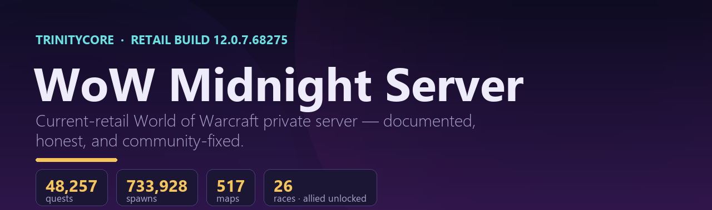
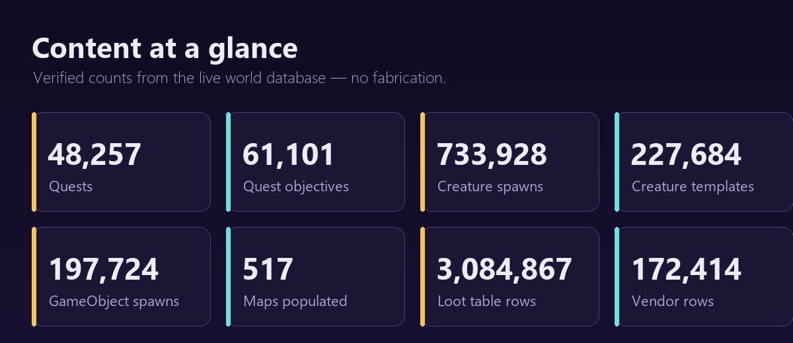
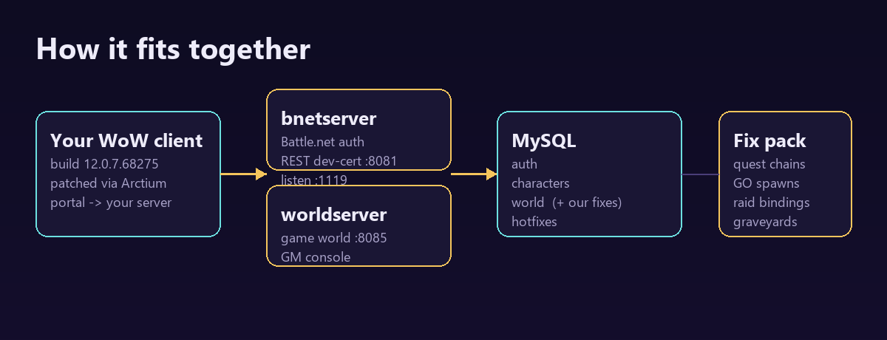

<!-- Язык: [English](README.md) · **Русский** -->



# WoW Midnight сервер — TrinityCore 12.0.7 (билд 68275)

> Документированный приватный сервер **World of Warcraft: Midnight** на базе
> **TrinityCore master**, на актуальном ретейл-билде **12.0.7.68275**, плюс
> набор оригинальных серверных фиксов, которые делают новейший контент реально
> играбельным.

**🌐 Язык:** [English](README.md) · **Русский**

> ⚠️ **Сначала прочти:** репозиторий содержит **только документацию и наши
> оригинальные фиксы**. В нём **нет** игрового клиента, игровых данных и базы
> мира — это собственность Blizzard, распространять её нельзя. Всё это ты
> собираешь сам из своего ретейл-клиента. См. **[DISCLAIMER.md](DISCLAIMER.md)**.

---

## Чем проект отличается от других

Большинство публичных приватных серверов WoW работают на **старых аддонах**
(Wrath 3.3.5a, Cata, MoP…). Этот нацелен на **актуальный ретейл — патч 12.0.7
«Midnight»** и держится честным и играбельным:

| | Этот проект | Типичный приватный сервер |
|---|---|---|
| **Билд клиента** | **12.0.7.68275 (Midnight, актуальный ретейл)** | 3.3.5a / 4.3.4 / 5.4.8 |
| **Расы** | Все 26, **союзные расы разблокированы**, работает **интро Драктиров-Эвокеров** | Только классические |
| **Охват контента** | Vanilla → Midnight в одной БД, заполнено **517 карт** | Один аддон |
| **Спутники-боты** | Боты-существа (`.bot`) + боты-игроки (`.pbot`) | Обычно нет |
| **Политика данных** | Максимизировано до **потолка публичных данных**, пробелы честно задокументированы | Часто молча сломано |
| **Фиксы** | Курируемые, обратимые, на безопасных ID-бандах **community-фиксы** (этот репо) | Разрозненные |

### Ключевое
- **Новейший контент, до которого реально дойти** — интро союзных рас и классов,
  современные зоны (Khaz Algar, Isle of Dorn, Harandar) с воскрешением и квестами.
- **Курируемый пак фиксов** — починка цепочек квестов, спавн объектов,
  блокирующих квесты, привязки лок-аутов/журнала легаси-рейдов, кладбища
  новейших зон. Всё аддитивное, обратимое, на пустых ID-бандах — не конфликтует
  со стоковой установкой.
- **Честная инженерия** — где движок упирается в реальный потолок (боевой ИИ
  боссов, скриптинг новейших фазовых сцен), это задокументировано, а не подделано.

---

## Контент в цифрах (проверенные значения БД)

| Метрика | Кол-во |
|---|---:|
| Квесты | **48 257** |
| Цели квестов | 61 101 |
| Дающие / принимающие квесты (NPC) | 27 694 / 34 524 |
| Шаблоны существ / спавны | 227 684 / **733 928** |
| Шаблоны объектов / спавны | 89 967 / 197 724 |
| Карты со спавнами | **517** |
| Строк таблиц лута | 3 084 867 |
| Строк вендоров | 172 414 |
| Ретейл-билд | **12.0.7.68275** |

---



## Галерея

### Архитектура



### Игровые скриншоты

> Это заглушки — положи свои реальные игровые скриншоты в
> `assets/screenshots/`, и они появятся здесь. (Мы **не** включаем игровые
> изображения Blizzard; см. [DISCLAIMER](DISCLAIMER.md).)

<!--


-->

_Скриншотов пока нет — вклад приветствуется._

## Быстрый старт

1. **Собери ядро** — TrinityCore master. → [docs/ru/SETUP.md](docs/ru/SETUP.md)
2. **Извлеки игровые данные** из своего ретейл-клиента (maps/vmaps/mmaps/dbc).
3. **Импортируй базу мира**, запусти `worldserver` + `bnetserver`.
4. **Применить community-фиксы** из [`sql/`](sql/). → [sql/README.md](sql/README.md)
5. **Подключи** клиент. → [docs/ru/CONNECT.md](docs/ru/CONNECT.md)

Полный гайд: **[docs/ru/SETUP.md](docs/ru/SETUP.md)** ·
Возможности и контент: **[docs/ru/FEATURES.md](docs/ru/FEATURES.md)** ·
Детали фиксов: **[docs/ru/FIXES.md](docs/ru/FIXES.md)**

---

## Структура репозитория

```
.
├── README.md / README.ru.md      Обзор проекта (EN / RU)
├── DISCLAIMER.md                 Юридическое — что можно и что нельзя публиковать
├── LICENSE                       MIT (только оригинальные материалы)
├── docs/
│   ├── en/  SETUP · CONNECT · FEATURES · FIXES
│   └── ru/  SETUP · CONNECT · FEATURES · FIXES
├── sql/                          Community-фиксы (обратимые, на безопасных ID-бандах)
└── scripts/                      vmssh.py (креды из env) · apply_fixes.sh
```

---

## Вклад

Issues и PR приветствуются — особенно дополнительные **обратимые, на безопасных
ID-бандах** фиксы данных для новейшего контента. Никогда не коммить секреты и
игровые ассеты Blizzard (`.gitignore` защищает от обоих). См. [DISCLAIMER.md](DISCLAIMER.md).

## Благодарности

Собрано на [TrinityCore](https://www.trinitycore.org/) (GPL-2.0). World of
Warcraft® © Blizzard Entertainment. Фанатский, некоммерческий, образовательный
проект.
